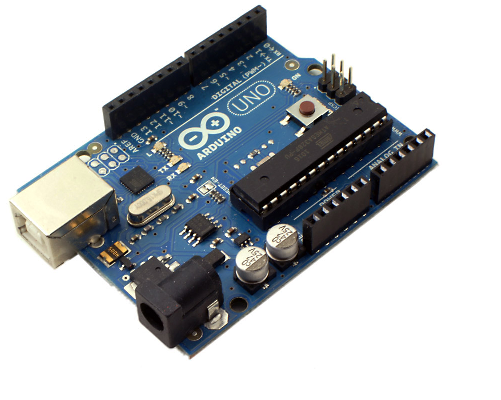
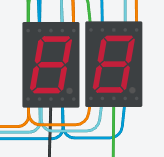
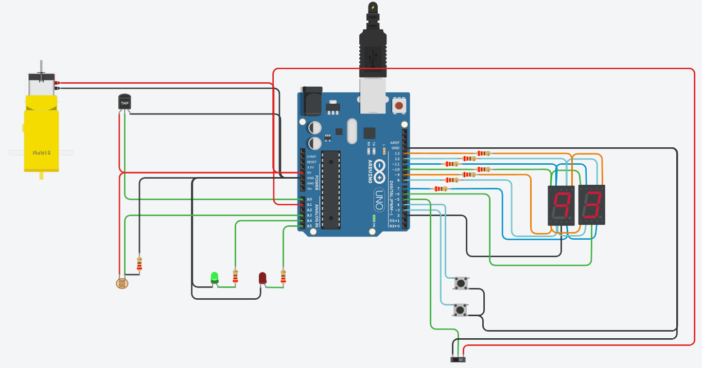

## DOCUMENTACION DEL TRABAJO PRACTICO DE SPD

- **Alumno**: Matias Emanuel Briceño Castillo

 - **Legajo**: 115466

### INTEGRANTES

- Almonacid, Emir Leandro

- Cabral, Ezequiel Matias

 

### Desarrollo del proyecto

El proyecto consta de 3 partes evolutivas donde se enmpieza mostrando un contador y finaliza con la integracion de un sensor de temperatura, un motor de aficionado, una foto resistencia, leds, un interruptor y se agrego la capacidad de contar y mostrar tambien los numeros primos que se encuentran entre 0 y 97.
El proceso de integracion sera explicado en las siguientes lineas 

* ### Parte 1

La primera PARTE inicia con 2 display de 7 segmentos que mostraran los numeros del 0 al 99 estando conectados en serie desde el pine 13 hasta el 7 inclusive, todos ellos configurados con la modalidad OUTPUT los cuales se encargaran de brindar la entrada de corriente.
Como salida de la corriente, los display, estan conectados a los pines analogicos A4 Y A5, tambien con la modalidad OUTPUT.
El funcionamiento del display es el siguiente, cada display contiene 7 leds y estos se encienden  si la corriente circula a traves de ellos. Para que circule la corriente, el pin al que estan conectado cada led les tiene que entregar corriente y esta ultima debe circular a traves de ellos donde la salida es el pin A4 para el display que muestra la unidad y el pin A5 para el que muestra la decena.
Entonces para que circule la corriente la configuracion el pin que entrega corriente debe ser 1 y se escribe en el codigo de la siguiente manera:

~~~ C++
  //PASARLE COMO PARAMETRO HIGH O 1 ES LO MISMO
  digitalWrite(A4,1);
  //ASI TAMBIEN FUNCIONA
  digitalWrite(A4,HIGH);
~~~

Como el pin A4 O A5 tambien estan configurado para entregar corriente solamente la corriente podra fluir si el estado de ellos es 0 o LOW.

~~~ C++
  //PASARLE COMO PARAMETRO LOW O 0 ES LO MISMO
  digitalWrite(A4,0);
  //ASI TAMBIEN FUNCIONA
  digitalWrite(A4,LOW);
~~~

Adjuntamos ejemplo y su explicacion
Si todos los pines que entregan corrientes estan configurados como HIGH y los pines A4 Y A5 estan configurados como low, el codigo y lo que se vera en los display sera lo siguiente

~~~ C++

  // permitimos la entrega de corriente de todos los pines
  digitalWrite(A,HIGH);
  digitalWrite(B,HIGH);
  digitalWrite(C,HIGH);
  digitalWrite(D,HIGH);
  digitalWrite(E,HIGH);
  digitalWrite(F,HIGH);
  digitalWrite(G,HIGH);

  //impedimos la entrega de corriente de los pines A4 y A5

  digitalWrite(DISPLAYUNI,LOW);
  digitalWrite(DISPLAYDEC,LOW);

~~~
 

Por ultimo tambien contamos con 3 pulsadores, uno para reinicar el contador, otro para avanzar al siguiente numero y el ultime para retroceder un numero.

* ### Proyecto final

  

